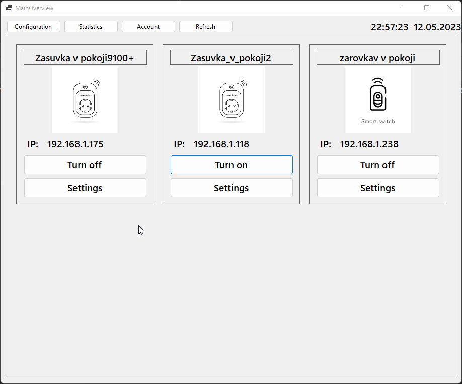
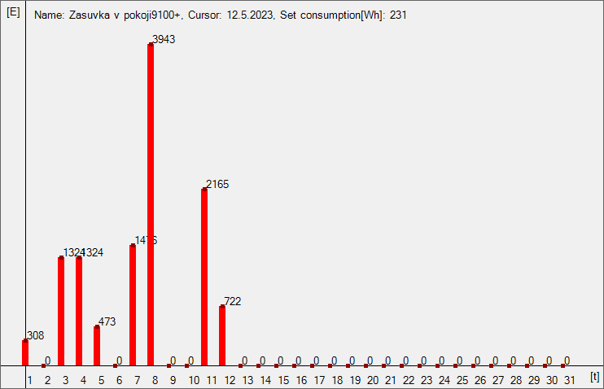
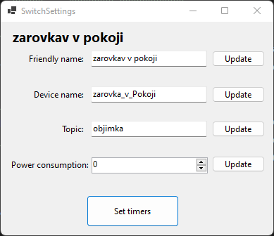
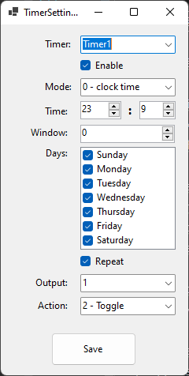
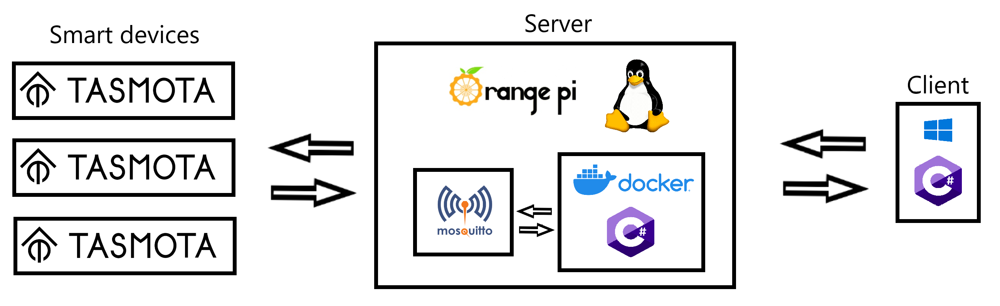

# Simple Home Assistant

Jedná se o jednoduchou aplikaci, která dokáže vyhledat a následně ovládat chytrá zařízení v domácnosti.

## Podstatné charakteristiky

### Rozdělení do dvou aplikací

Projekt je rozdělen do dvou samostatných aplikací a to serverové a klientské.

- Server pomocí Mqtt protokolu komunikuje s jednotlivými chytrými zařízeními,
  sbírá o nich statistická data a konfiguruje je. Na serveru běží také http server, pomocí něhož je umožněna komunikace
  s klientem.
- Klient slouží převážně ke zobrazení dat ze serveru. Pomocí klienta můžeme na server posílat POST requesty s různými
  příkazy například při konfiguraci.

### Správa a řízení připojených zařízení

Pro správu jednotlivých zařízení je na serveru třída MqttManager.

- Tato třída je správcem seznamu připojených zařízení ***DevicesRegister***. Zařízení je reprezentováno objektem Device.
  Ten obsahuje základní informace jak o samotném zařízení například FriendlyName nebo DeviceName, tak i třeba o
  připojení k němu například Mac nebo Ip.
- Má také na starost třídy ***DeviceProfilesManager*** a ***StatisticsManager***, z nichž získává data požadovaná http serverem jako
  response na request klienta.
- Obsahuje také metody jako jsou například: ***SetFriendlyName, SetDeviceTopic nebo SetTimer***. Tyto metody jsou volány
  příchozím požadavkem na jeden z ***endpointů http serveru***.
  Pro úspěštné splnění úkolu potřebuje každá z metod znát ***Topic*** zařízení, kterému chceme příkaz poslat. Pokud se jedná o
  příkaz je třeba ještě ***Payload***.
  Protože obě tyto informace musí přijít z klienta, je zde pro snadnější posílání dat objekt jménem ***BasicMessage***, který
  obsahuje právě ***Topic a Payload***. Tento objekt se pak v klientu serializuje do ***Jsonu*** a jako payload requestu pošle na
  server.

### Objevování nových zařízení

Ke získání informací o nově připojených zařízeních je zde ***MqttDevicesDiscoveryWorker***, který je potomkem ***MqttWorkera***.

- Worker je spouštěn po určitém časovém intervalu časovačem běžícím v ***MqttManagerovi***. Po spuštění se vytvoří nové
  vlákno
  a v něm pak worker koná své povinnosti. Zařízení občas neodpoví na volání hned a je tedy nutné chvíli poslouchat, zda
  se nějaké zařízení neopozdilo. Toto čekání by zpomalovalo hlavní proces a nebylo by se možné během toho dovolat z
  klienta, to je tedy důvod pro vytvoření nového vlákna.
- Pro zjištění worker pošle broadcastem zprávu všem zařízením připojeným k mqtt brokeru. Po přijetí odpovědí se worker
  podívá, zda nepřišla zpráva od zařízení, které není v ***DevicesRegister***, a pokud ano, vyžádá si od něj podrobné
  informace a přidá ho do ***DevicesRegister***.
- Každý mqtt worker, který je potomkem MqttWorkera, má parameter ***TTL(time to live)***, který je defaultně nastavený
  na 10s
  a po uplynutí tohoto času worker odevzdá svou práci a ukončí se, aby worker nezůstal viset při nějakém úkolu a
  nezabíral zbytečně výkon a paměť.

### Tvorba statistik

Správu statistických dat na serveru a jejich výdej zajišťuje třída ***StatisticsManager***.

- Naměřená data za daný den si manager ukládá do seznamu ***_todayDeviceStatistics***. Seznam se v určitém intervalu
  ukládá do souboru s Timestamp datumem daného dne, aby při vypnutí počítače nedošlo ke ztrátě všech dat. Pokud se
  server zapne a existuje již soubor s daty z daného dne, tento soubor se načte do ***_todayDeviceStatistics*** a při
  autosavu se soubor přepíše, aby se zbytečně nevytvářelo mnoho souborů.

Za účelem získávání přibližných statistik v podobě informace, zda je daný vypínač zapnutý či vypnutý, je použit
***MqttDevicesPowerStatesWorker***, který je také potomkem ***MqttWorkera***.

- Tento worker spouštěn v časovém intervalu timerem běžícím v ***StatisticsManagerovi***.
- Worker posílá dotazy na jednotlivá zařízení v ***DevicesRegisteru*** a výsledky si společně s časem měření
  ukládá.

### Profily zařízení

Profily zařízení slouží pro ukládání informací o daném zařízení pro účely aplikace.

- Jednou z informací je třeba průměrná spotřeba zařízení připojeného do dané zásuvky, kterou nastaví uživatel.
- Tato data na serveru spravuje ***DeviceProfilesManager***.
- Data jsou při každé změně ukládána a při startu se načtou do seznamu ***_profiles***.

### Autentikace uživatele

Autentikaci na straně serveru obstarává ***AuthenticationManager***, který má přihlašovací údaje, tedy kombinace ***user
a password***, uložené v seznamu ***_registeredCredentials***. Data jsou okamžitě po změně ukládána do souboru, aby nedošlo
ke ztrátě.

- Přihlašovací údaje přicházejí v headeru každého requestu a až po ověření, zda jsou obsaženy v seznamu možných
  přihlašovacích údajů, začne server provádět danou
  akci. Pokud data správná nejsou, další operace se již neprovádějí a jako response se odešle kód ***401***.

### Hlavní přehled připojených zařízení

***Hlavní přehled*** je první věc, co uživatel uvidí, při spuštění ***klienta***. Jedná se o hlavní rozcestník do zbytku klientské
aplikace.

- V horní liště je menu s tlačítky pro otevření ***konfigurace aplikace***, ***statistik***, ***dialogového okna pro zadání
  přihlašovacích údajů***
  a ***tlačítko pro znovunačtení*** aktuálně zobrazených zařízení ze serveru. Vedle tlačítek jsou ještě hodiny ukazující
  aktuální datum a čas. Tlačítko konfigurace umožní nastavit IP adresu serverové aplikace.
- Zbytek okna pokrývá panel, na kterém jsou zobrazeny dlaždice představující jednotlivá zařízení. Na dlaždicích je
  zobrazeno jméno a IP adresa daného zařízení. V případě, že dlaždice zobrazuje vypínač, jsou na ní dvě tlačítka, a to
  pro vypnutí a zapnutí a druhé, které otevře dialog pro nastavení zařízení.

### Zobrazení statistik

- Na okně pro zobrazení statistik se v levé části nachází panel, na kterém jsou vylistovaná aktuální zařízení
  reprezentovaná tlačítkem s názvem zařízení.
- Ve zbytku okna se nachází sloupcový graf znázorňující spotřebu energie za daný časový úsek. Graf lze zobrazit ve 3
  módech, a to pohled na jednotlivé hodiny, dny a měsíce. V konkrétním módu je možné se posouvat tlačítky vpřed a vzad.
- Statistika je vypočítávána na základě údajů posbíraných ***MqttDevicesPowerStatesWorkerem*** a zadané spotřebě pro
  dané zařízení, kterou poskytuje ***DeviceProfilesManager***.
- Graf lze vyexportovat do formátu ***.bmp*** stisknutím tlačítka ***Export***.

### Správu účtů

- Pomocí tohoto dialogu uživatel nastavuje s jakými přihlašovacími údaji má klient komunikovat.
- Dále je zde možnost odstranit aktuálně zadaný účet nebo přidat nový.

### Nastavování jednotlivých zařízení

Dialog nastavení zařízení poskytuje možnost základní konfigurace.

- Pomocí tohoto dialogu lze nastavit jak FriendlyName tak DeviceName, Topic. V případě vypínače je ještě možné nastavit
  spotřebu pro tvorbu grafu a všech 16 časovačů, kterými vypínače disponují. Tlačítkem Save se změny odešlou na server.

## Ukázky

### Hlavní ovládací panel

### Graf spotřeby jednotlivých dnů v měsíci

### Dialog pro základní nastavení zařízení

### Dialog pro nastavení časovačů

### Technologická topologie projektu

## Použité technologie

### Webové api

- K vytvoření vlastního api byla použita knihovna Simple-HTTP. Odkaz na knihovnu je
  zde ___https://www.nuget.org/packages/Simple-HTTP___.

### Komunikace se zařízeními

- Pro komunikaci s Mqtt brokerem pomocí protokolu Mqtt je použita nuget knihovna MQTTnet. Odkaz na knihovnu je
  zde ___https://github.com/dotnet/MQTTnet___.

### Programovací jazyk

- Jako programovací jazyk byl zvolen ***C# .NetCore 6*** kvůli kompatibilitě s řůznými platformami a hlavně s dockerem.

## Užitečné odkazy pro práci s Tasmota zařízeními

### Nahrání nového firmwaru do Sonoff zařízení
připojení k Arduinu - https://makeitmore.fun/smarthome/how-to-flash-sonoff-devices-using-arduino
nahrání softwaru - https://tasmota.github.io/docs/Getting-Started/

### Nastavení a instalace mosquitto mqtt broker
kompletní návod - https://www.vultr.com/docs/install-mosquitto-mqtt-broker-on-ubuntu-20-04-server/
instalace brokeru a klienta - https://www.youtube.com/watch?v=KOohvO4ngTw
nastavení autentikace - https://www.youtube.com/watch?v=PO8RRLV10K8

### Příklad pro publisher a subscriber pomocí MQTTnet
https://www.youtube.com/watch?v=lcsnsj1yBs0

### Tasmota MQTT dokumentace
https://tasmota.github.io/docs/MQTT/#command-flow

## Autor: Jaroslav Němec T2 SSAKHK 2022/2023
